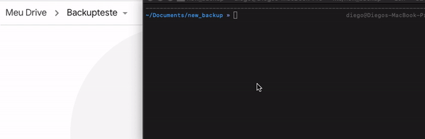

# Backup MySQL Google Drive

Esta biblioteca ajuda a realizar backups do banco de dados MySQL e enviá-los para o Google Drive.



## 📖 Sumário

1. [📌 Visão Geral](#-visão-geral)
2. [🛠️ Configuração](#️-configuração)
   - [📂 Backup](#-backup)
   - [⏳ Cron](#-cron)
   - [☁️ Google Drive](#-google-drive)
   - [📧 E-mail](#-mail)
3. [✅ Funcionalidades](#-funcionalidades)
4. [📦 Instalação](#-instalação)
5. [⚡ Uso](#-uso)
6. 📝 [Licença](./LICENSE.md)

<br/>

## 📌 Visão Geral

Esta biblioteca encapsula diversas funcionalidades para facilitar o backup do banco de dados e armazenamento na nuvem de forma prática e segura.

<br/>

## 🛠️ Configuração

### 📂 Backup

| Propriedade    | Tipo   | Descrição                          | Padrão   | Obrigatório |
| -------------- | ------ | ---------------------------------- | -------- | ----------- |
| host           | string | Host do banco de dados MySQL       | -        | ✅          |
| user           | string | Nome do usuário root do MySQL      | -        | ✅          |
| password       | string | Senha do banco de dados            | -        | ✅          |
| keep_files     | number | Número de backups a serem mantidos | 10       | ❌          |
| folder_backups | string | Pasta onde os backups serão salvos | ./backup | ❌          |

<br/>

### ⏳ Cron

> Use [crontab.guru](https://crontab.guru/) para gerar uma expressão cron.

| Propriedade | Tipo   | Descrição                 | Padrão            | Obrigatório |
| ----------- | ------ | ------------------------- | ----------------- | ----------- |
| active      | bool   | Ativa a execução via cron | false             | ✅          |
| time        | string | Horário da execução       | `*/2 * * * *`     | ✅          |
| timezone    | string | Fuso horário              | America/Sao_Paulo | ✅          |

<br/>

### ☁️ Google Drive

> Veja como configurar a API do Google Drive neste [link](https://developers.google.com/drive/api/v3/quickstart/nodejs).

| Propriedade   | Tipo   | Descrição                      | Padrão | Obrigatório |
| ------------- | ------ | ------------------------------ | ------ | ----------- |
| active        | bool   | Ativa o backup no Google Drive | false  | ✅          |
| client_id     | string | ID do cliente OAuth            | -      | ✅          |
| client_secret | string | Chave secreta do cliente OAuth | -      | ✅          |
| folder_id     | string | ID da pasta no Google Drive    | -      | ❌          |

<br/>

### 📧 Mail

| Propriedade | Tipo   | Descrição                                | Padrão                         | Obrigatório |
| ----------- | ------ | ---------------------------------------- | ------------------------------ | ----------- |
| active      | bool   | Ativa o envio de notificações por e-mail | false                          | ✅          |
| host        | string | Servidor SMTP                            | -                              | ✅          |
| port        | number | Porta do SMTP                            | -                              | ✅          |
| secure      | bool   | Define se a conexão é segura             | -                              | ✅          |
| user        | string | Usuário SMTP                             | -                              | ✅          |
| pass        | string | Senha do SMTP                            | -                              | ✅          |
| from        | string | Remetente do e-mail                      | -                              | ✅          |
| to          | string | Destinatário do e-mail                   | -                              | ✅          |
| subject     | string | Assunto do e-mail                        | "Backup realizado com sucesso" | ❌          |
| text        | string | Corpo do e-mail                          | "Backup realizado com sucesso" | ❌          |

<br/>

## ✅ Funcionalidades

- ✅ Backup do banco de dados MySQL
- ✅ Login dinâmico com Google Drive
- ✅ Envio do arquivo de backup para o Google Drive
- ✅ Limitação de backups enviados
- ✅ Exclusão de arquivos localmente e no Google Drive
- ✅ Controle de logs
- ✅ Envio de alerta por e-mail
- ✅ Agendamento via cron dinâmico

<br/>

## 📦 Instalação

```sh
yarn add backup-mysql-google-driver
```

<br/>

## ⚡ Uso

```js
const monitor_backup = require("backup-mysql-google-driver");

monitor_backup({
  backup: {
    host: "",
    user: "",
    password: "",
    database: "",
    keep_files: 10,
  },

  cron: {
    active: false,
    time: `*/10 * * * *`,
    timezone: `America/Sao_Paulo`,
  },

  google_drive: {
    active: false,
    client_id: "",
    client_secret: "",
    folder_id: "",
  },

  mail: {
    active: false,
    host: "",
    port: 465,
    secure: true,
    user: "",
    pass: "",
    from: "Nome <email@email.com>",
    to: "",
    subject: "",
    text: "",
  },
});
```
